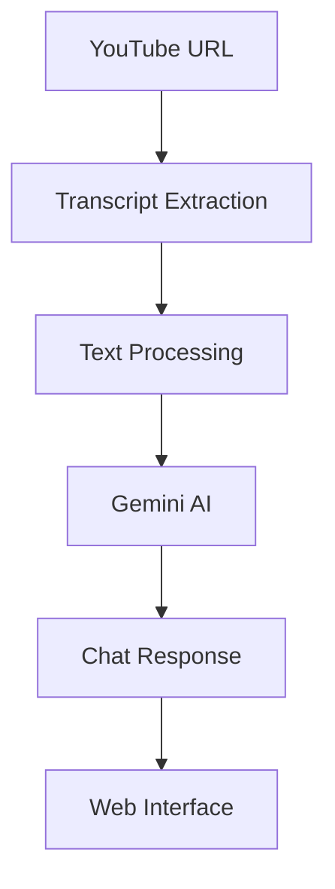

<div align="center">

# 🎥 YouTube Video Chat App

**Chat with any YouTube video using AI - Extract transcripts and have intelligent conversations**

[](https://python.org)
[](https://flask.palletsprojects.com)
[](https://ai.google.dev)
[](LICENSE)

[Demo](#demo) • [Features](#features) • [Quick Start](#quick-start) • [Usage](#usage) • [API](#api)

</div>

---

## 🚀 Demo

```
🎬 Paste YouTube URL → 🤖 AI processes transcript → 💬 Chat about video content
```

**Example Conversation:**
```
User: "What are the main points discussed in this video?"
AI: "Based on the transcript, the video covers 3 main topics: ..."

User: "Can you explain the concept mentioned at 5:30?"
AI: "At that timestamp, the speaker discusses ..."
```

## ✨ Features

| Feature | Description |
|---------|-------------|
| 🎥 **Video Processing** | Extract transcripts from any YouTube video with captions |
| 🤖 **AI Chat** | Powered by Google Gemini 1.5 Flash for intelligent responses |
| 🔍 **Smart Search** | Find relevant video segments with text-based search |
| ⚡ **Fast & Simple** | No complex databases or vector embeddings required |
| 🌐 **Web Interface** | Clean, responsive UI with real-time chat |
| 🆓 **Cost Effective** | No quota limits or embedding costs |

## 🏃‍♂️ Quick Start

### Prerequisites
- Python 3.8+
- Google AI API Key ([Get one free](https://makersuite.google.com/app/apikey))

### Installation

1. **Clone & Navigate**
   ```bash
   git clone https://github.com/Ayush-AM/Dev.git
   cd 2_youtube_chat_app
   ```

2. **Setup Environment**
   ```bash
   # Windows
   python -m venv venv
   venv\Scripts\activate
   
   # macOS/Linux
   python3 -m venv venv
   source venv/bin/activate
   ```

3. **Install Dependencies**
   ```bash
   pip install -r requirements.txt
   ```

4. **Configure API Key**
   ```bash
   # Create .env file
   echo GOOGLE_API_KEY="your_api_key_here" > .env
   ```

5. **Launch App**
   ```bash
   python application.py
   ```

6. **Open Browser**
   ```
   http://127.0.0.1:5001
   ```

## 📖 Usage

### Step-by-Step Guide

1. **📝 Enter YouTube URL**
   - Paste any YouTube video URL with captions/subtitles
   - Supports: `youtube.com/watch?v=...` or `youtu.be/...`

2. **⚙️ Process Video**
   - Click "Process Video" button
   - Wait for "Video processed successfully!" message

3. **💬 Start Chatting**
   - Ask questions about video content
   - Get AI-powered responses with context

### 💡 Example Queries

| Query Type | Example |
|------------|----------|
| **Summary** | "What are the key takeaways from this video?" |
| **Specific Topic** | "Explain the concept mentioned at 10:30" |
| **Analysis** | "What's the speaker's main argument?" |
| **Details** | "List all the tools mentioned in the video" |

## 📁 Project Structure

```
2_youtube_chat_app/
├── 📄 application.py          # Main Flask app (Production Ready)
├── 📄 app.py                 # Advanced RAG version (Future)
├── 📄 agent.py               # Pinecone integration
├── 📄 simple_agent.py        # Lightweight agent
├── 📁 templates/
│   └── 📄 index.html         # Web interface
├── 📄 requirements.txt       # Dependencies
├── 📄 requirements_simple.txt # Minimal dependencies
├── 📄 .env                   # Environment variables (ignored)
├── 📄 .gitignore            # Git ignore rules
└── 📄 README.md             # Documentation
```

## 🛠️ Technical Stack

| Component | Technology | Purpose |
|-----------|------------|----------|
| **Frontend** | HTML/CSS/JavaScript | Clean, responsive UI |
| **Backend** | Flask | Lightweight web framework |
| **AI Model** | Google Gemini 1.5 Flash | Natural language processing |
| **Transcript** | YouTube Transcript API | Video text extraction |
| **Search** | Text-based matching | Fast content retrieval |
| **Storage** | In-memory | No database required |

## 🏗️ Architecture



## 🔧 Troubleshooting

<details>
<summary><b>❌ "No transcript available"</b></summary>

**Cause:** Video doesn't have captions/subtitles

**Solutions:**
- ✅ Use videos with auto-generated captions
- ✅ Try educational/tutorial videos (usually have captions)
- ✅ Check if captions are enabled on YouTube

</details>

<details>
<summary><b>🔑 "API Key Error"</b></summary>

**Cause:** Invalid or missing Google API key

**Solutions:**
- ✅ Verify API key in `.env` file
- ✅ Get new key from [Google AI Studio](https://makersuite.google.com/app/apikey)
- ✅ Check API key permissions
- ✅ Ensure no extra spaces in `.env`

</details>

<details>
<summary><b>🚪 "Port already in use"</b></summary>

**Cause:** Another process using port 5001

**Solutions:**
- ✅ Change port: `app.run(port=5002)` in `application.py`
- ✅ Kill existing process: `taskkill /f /im python.exe` (Windows)
- ✅ Use different port: `python application.py --port 5002`

</details>

<details>
<summary><b>📦 "Module not found"</b></summary>

**Cause:** Missing dependencies or virtual environment

**Solutions:**
- ✅ Activate virtual environment: `venv\Scripts\activate`
- ✅ Reinstall: `pip install -r requirements.txt`
- ✅ Check Python version: `python --version` (3.8+ required)

</details>

## 🚀 Development Roadmap

### 🟢 Current Version (`application.py`)
| Feature | Status |
|---------|--------|
| Basic transcript extraction | ✅ Complete |
| Gemini AI integration | ✅ Complete |
| Web interface | ✅ Complete |
| Text-based search | ✅ Complete |
| Zero setup complexity | ✅ Complete |

### 🟡 Future Version (`app.py`)
| Feature | Status |
|---------|--------|
| Vector embeddings | 🔄 In Progress |
| Pinecone integration | 🔄 Planned |
| Advanced RAG | 🔄 Planned |
| Semantic search | 🔄 Planned |
| Multi-video chat | 🔄 Planned |

## 📋 Requirements

- **Python**: 3.8 or higher
- **API Key**: Google AI (free tier available)
- **Internet**: Required for YouTube access
- **Videos**: Must have captions/subtitles

## 🤝 Contributing

We welcome contributions! Here's how:

1. **🍴 Fork** the repository
2. **🌿 Create** a feature branch: `git checkout -b feature/amazing-feature`
3. **💾 Commit** changes: `git commit -m 'Add amazing feature'`
4. **📤 Push** to branch: `git push origin feature/amazing-feature`
5. **🔄 Open** a Pull Request

### 🎯 Areas for Contribution
- 🐛 Bug fixes
- ✨ New features
- 📚 Documentation improvements
- 🧪 Test coverage
- 🎨 UI/UX enhancements

## 📄 License

This project is licensed under the **MIT License** - see the [LICENSE](LICENSE) file for details.

## 💬 Support & Community

- 🐛 **Issues**: [GitHub Issues](https://github.com/Ayush-AM/Dev/issues)
- 💡 **Feature Requests**: [GitHub Discussions](https://github.com/Ayush-AM/Dev/discussions)
- 📧 **Contact**: Create an issue for support

## ⭐ Show Your Support

If this project helped you, please consider:
- ⭐ **Starring** the repository
- 🐛 **Reporting** bugs
- 💡 **Suggesting** features
- 🤝 **Contributing** code

---

<div align="center">

**Built with ❤️ using Google Gemini AI**

[⬆️ Back to Top](#-youtube-video-chat-app)

</div>